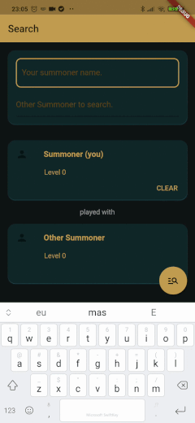
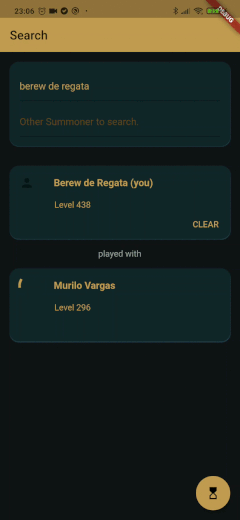

# League
A Flutter basic aplication  to practice dart language.
This application will be connect to Riot's (riot games) API to get list of all champions of league of legends and show
details in the screen. And verify if some summoner in this current match have played before matchs with you.

## Getting Started

This project is a starting point for a Flutter application.

A few resources to get you started if this is your first Flutter project:

- [Lab: Write your first Flutter app](https://flutter.dev/docs/get-started/codelab)
- [Cookbook: Useful Flutter samples](https://flutter.dev/docs/cookbook)

For help getting started with Flutter, view our
[online documentation](https://flutter.dev/docs), which offers tutorials,
samples, guidance on mobile development, and a full API reference.

>### v0.0.1 :heavy_check_mark:
>Static List
>>this version is showing list from hardcode array;

>### v0.0.2 :heavy_check_mark:
>Connect to riot's API. 
>>this version will get a json list from riot's API.

>### v0.0.3 :heavy_check_mark:
>Data and json objects. 
>>this version will manipulate json list and convert to objects and.

>### v0.0.4 :heavy_check_mark:
>For this version i'm going to do implement shared preferences for summoner data of user of app. 
>>Removed champion's count from toolbar.
>>'late' error by call of _apiResponse. 
>Error late initialization _responseApi. Estudar mais sobre controle de estado e future. 
>>Late initialization solved whit future functions and state management 
>>Navigation.push to second screen for search summoner. Changed main.dart to start app with screen to search other summoner. 

>### v0.0.5 :heavy_check_mark:
>I want to search in my history matches if another player was played with me. 
>Changes in design layout of app. 
>>get list with the last five matchesId of summoner in sharedPref. (user of app). 
>>get list history matches in acording of matchId 
>>verify in the list if 'other summoner' was played with me by 'puuid'.  
>>changes layout theme color and validation on inputs. 
>>getting matchesId from history matches of summoner and searching in the matchesTimeline for identificate matches that the summoners play with me.  

>>Gif 1: get players from api 
>>Gif 2: other summoner ALREADY played with you in last 5 matches 
>>Gif 3: other summoner NOT ALREADY played with you in last 5 matches 
  
 
>### Next Steps :clipboard: 
>Do refactor code. 
>Learn about state control with [Provider](https://pub.dev/packages/provider) 
>Learn about automated testing. 
>For this version i'm going to do some tests to learn about automated testing in flutter aplication. 
>StorageData and assets. 

### Content that i'am following to do this project can be finded in:
- [Programming Addict - Interacting with a REST API | HTTP Methods, Status Codes... | Consuming a REST API in Flutter] (https://www.youtube.com/watch?v=ZMNp9Ev6cl0) 

### Main Troubles
- [Insecure HTTP connections are disabled by default on iOS and Android](https://flutter.dev/docs/release/breaking-changes/network-policy-ios-android)
